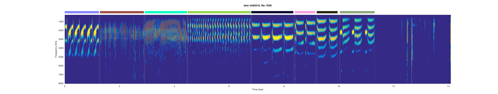

# tf_syllable_segmentation_annotation

(The phrase segmentation of a canary song)
A library that segments and labels birdsong and other vocalizations

## Installation
To install, run the following command at the command line:
`pip install cnn_bilstm`

Best practice is to use a virtual environment. If you install from `pip` you can 
use `virtualenv` or `pipenv`. In many cases it may be easier to install 
[Anaconda](https://www.anaconda.com/download), and use their `conda` command-line tool 
to create environments and install the scientific libraries that this package 
depends on. Here's how you'd set up a `conda` environment:  
`/home/you/code/ $ conda create -n cnn-bilstm python=3.5 numpy scipy joblib tensorflow-gpu ipython jupyter`    
`/home/you/code/ $ source activate cnn-bilstm`  
(You don't have to `source` on Windows: `> activate cnn-bilstm`)  

You can use `pip` inside a `conda` environment:
`(cnn-bilstm)/home/you/code/ $ pip install cnn_bilstm`

You can also work with a local copy of the code.
It's possible to install the local copy with `pip` so that you can still edit 
the code, and then have its behavior as an installed library reflect those edits. 
  * Clone the repo from Github using the version control tool `git`:  
`(cnn-bilstm)/home/you/code/ $ git clone https://github.com/yardencsGitHub/tf_syllable_segmentation_annotation`  
(you can install `git` from Github or using `conda`.)  
  * Finally install the package with `pip` using the `-e` flag (for `editable`).
`$ (cnn-bilstm)/home/you/code/ $ cd tf_syllable_segmentation_annotation`
`$ (cnn-bilstm) pip install -e .`  

## Usage
### Training cnn-bilstm models to segment and label birdsong
To train models, use the `main.py` script.
You run it with `config.ini` files, using one of three command-line flags:
You can run `main.py` with a single `config.ini` file by using the  `--config` 
flag and passing the name of the config.ini file as an argument:  
`(cnn-bilstm-conda-env)$ python main.py --config ./configs/config_bird0.ini`  

For more details on how training works, see [experiments.md](./experiments.md), 
and for more details on the config.ini files, see [README_config.md](./README_config.md).

### Data and folder structures
To train models, you must supply training data in the form of audio files or 
spectrograms, and annotations for each spectrogram.
#### Spectrograms and labels
The package can generate spectrograms from `.wav` files or `.cbin` files.
It can also accept spectrograms in the form of Matlab `.mat` files.
The locations of these files are specified in the `config.ini` file as explained in 
[experiments.md](./experiments.md) and [README_config.md](./README_config.md).

### Important model parameters
* The following parameters must be correctly defined in the configuration `.ini` [file](./README_config.md).
  * input_vec_size - Must match the number of frequency bins in the spectrograms (current value is 513).
  * n_syllables - Must be the correct number of tags, including zero for non-syllable.
  * time_steps - The number of bins in a training snippet (current value is 87). The code concatenates all training data and trains the deep network using batches, containing snippets of length 'time_steps' from different points in the data. It is recommended to set 'time_steps' such that the snippets are of about 1 second.
* The following parameters can be changed if needed:
  * n_max_iter - The maximal number of training steps (currently 18001).
  * batch_size - The number of snippets in each training batch (currently 11)
  * learning_rate - The training step rate coefficient (currently 0.001)
Other parameters that specify the network itself can be changed in the code but require knowledge of tensorflow.

## Preparing training files

It is possible to train on any manually annotated data but there are some useful guidelines:
* __Use as many examples as possible__ - The results will just be better. Specifically, this code will not label correctly syllables it did not encounter while training and will most probably generalize to the nearest sample or ignore the syllable.
* __Use noise examples__ - This will make the code very good in ignoring noise.
* __Examples of syllables on noise are important__ - It is a good practice to start with clean recordings. The code will not perform miracles and is most likely to fail if the audio is too corrupt or masked by noise. Still, training with examples of syllables on the background of cage noises will be beneficial.

### Results of running the code


__It is recommended to apply post processing when extracting the actual syllable tag and onset and offset timesfrom the estimates.__

## Predicting new labels

To reload a saved model, you use a checkpoint file saved by the
Tensorflow checkpoint saver. Here's an example of how to do this, taken 
from the `cnn_bilstm.train_utils.learn_curve` function:
```Python
meta_file = glob(os.path.join(training_records_dir, 'checkpoint*meta*'))[0]
data_file = glob(os.path.join(training_records_dir, 'checkpoint*data*'))[0]

model = CNNBiLSTM(n_syllables=n_syllables,
                  input_vec_size=input_vec_size,
                  batch_size=batch_size)

with tf.Session(graph=model.graph) as sess:
    model.restore(sess=sess,
                  meta_file=meta_file,
                  data_file=data_file)
```


## Model architecture
The architecture of this deep neural network is based on these papers:
* S. Böck and M. Schedl, "Polyphonic piano note transcription with recurrent neural networks," 2012 IEEE International Conference on Acoustics, Speech and Signal Processing (ICASSP), Kyoto, 2012, pp. 121-124.
doi: 10.1109/ICASSP.2012.6287832 (http://ieeexplore.ieee.org/stamp/stamp.jsp?tp=&arnumber=6287832&isnumber=6287775)
* Parascandolo, Huttunen, and Virtanen, “Recurrent Neural Networks for Polyphonic Sound Event Detection in Real Life Recordings.” (https://arxiv.org/abs/1604.00861)

The deep net. structure, used in this code, contains 3 elements:
* 2 convolutional and max pooling layers - A convolutional layer convolves the spectrogram with a set of tunable features and the max pooling is used to limit the number of parameters. These layers allow extracting local spectral and temporal features of syllables and noise.
* A long-short-term-memory recurrent layer (LSTM) - This layer allows the model to incorporate the temporal dependencies in the signal, such as canary trills and the duration of various syllables. The code contains an option to adding more LSTM layers but, since it isn't needed, those are not used.
* A projection layer - For each time bin, this layer projects the previous layer's output on the set of possible syllables. 

