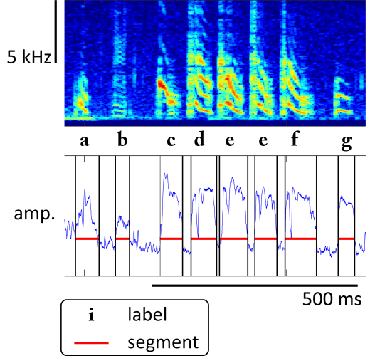

[](https://zenodo.org/badge/latestdoi/173566541)
[](https://badge.fury.io/py/vak)
[](https://opensource.org/licenses/BSD-3-Clause)
[](https://travis-ci.com/NickleDave/vak)
# vak
## automated annotation of animal vocalizations

`vak` is a library for researchers studying animal vocalizations.
It automates annotation of vocalizations, using artificial neural networks.
By annotation, we mean something like the example of annotated birdsong shown below:  


You give `vak` training data in the form of audio or spectrogram files with annotations, 
and then `vak` helps you train neural network models 
and use the trained models to predict annotations for new files.

### Installation
Short version:
```console
$ pip install vak
```
For the long version detail, please see:
https://vak.readthedocs.io/en/latest/get_started/installation.html

### Usage
#### Training models to segment and label vocalizations
Currently the easiest way to work with `vak` is through the command line.


You run it with `config.toml` files, using one of a handful of commands.

For more details, please see the "autoannotate" tutorial here:  
https://vak.readthedocs.io/en/latest/tutorial/autoannotate.html

#### Data and folder structures
To train models, you provide training data in the form of audio or 
spectrograms files, and annotations for those files.

#### Spectrograms and labels
The package can generate spectrograms from `.wav` files or `.cbin` audio files.
It can also accept spectrograms in the form of Matlab `.mat` or Numpy `.npz` files.
The locations of these files are specified in the `config.toml` file.

The annotations are parsed by a separate library, `crowsetta`, that 
aims to handle common formats like Praat `textgrid` files, and enable 
researchers to easily work with formats they may have developed in their 
own labs. For more information please see:  
https://crowsetta.readthedocs.io/en/latest/  
https://github.com/NickleDave/crowsetta  

#### Preparing training files
It is possible to train on any manually annotated data but there are some useful guidelines:
* __Use as many examples as possible__ - The results will just be better. Specifically, this code will not label correctly syllables it did not encounter while training and will most probably generalize to the nearest sample or ignore the syllable.
* __Use noise examples__ - This will make the code very good in ignoring noise.
* __Examples of syllables on noise are important__ - It is a good practice to start with clean recordings. The code will not perform miracles and is most likely to fail if the audio is too corrupt or masked by noise. Still, training with examples of syllables on the background of cage noises will be beneficial.

### Predicting annotations for audio
You can predict annotations for audio files by creating a `config.toml` file with a [PREDICT] section.  
For more details, please see the "autoannotate" tutorial here:
https://vak.readthedocs.io/en/latest/tutorial/autoannotate.html

### Support / Contributing
Currently we are handling support through the issue tracker on GitHub:  
https://github.com/NickleDave/vak/issues  
Please raise an issue there if you run into trouble.  
That would be a great place to start if you are interested in contributing, as well.

### Citation
If you use vak for a publication, please cite its DOI:  
[](https://zenodo.org/badge/latestdoi/173566541)

### License
[](https://opensource.org/licenses/BSD-3-Clause)  
is [here](./LICENSE).

### Misc
#### "Why this name, vak?"
It has only three letters, so it is quick to type,
and it wasn't taken on [pypi](https://pypi.org/) yet.
Also I guess it has [something to do with speech](https://en.wikipedia.org/wiki/V%C4%81c).
"vak" rhymes with "squawk" and "talk".

#### Does your library have any poems?
[Yes.](./doc/poem.md)
