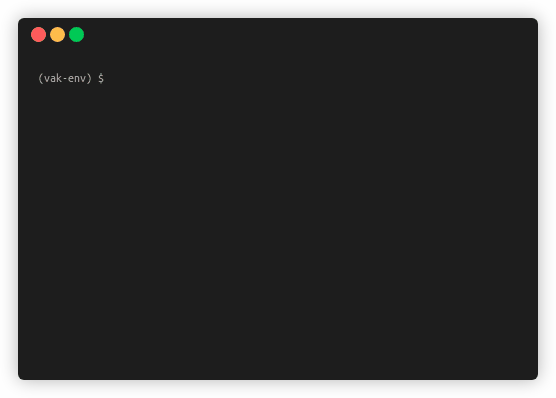

(installation)=

# Installation

This page explains how to install `vak`.
The library can be installed with the package managers `conda` or `pip`.
We recommend `conda` for most users. For more detail, please see {ref}`why-conda`.
We also recommend installing `vak` into a virtual environment.
For an explanation, please see {ref}`why-virtualenv`.

## Prerequisites

### A package manager

First you need a package manager, that can install `vak` and the other software libraries 
that it depends on. For example, the `conda` package manager that is installed for you 
with the Anaconda distribution (<https://docs.anaconda.com/anaconda/install/>).

If you prefer, you can also install `vak` with 
the Python package manager `pip` (<https://pip.pypa.io/en/stable/getting-started/>).

### A terminal program

You will also need to use a terminal program to run `vak` 
through its command-line interface, as shown below:  


On macOS, you can use the built-in 
[Terminal application](https://support.apple.com/guide/terminal/open-or-quit-terminal-apd5265185d-f365-44cb-8b09-71a064a42125/mac)
or alternatives like [iTerm2](https://iterm2.com/).
If you install Anaconda, then `conda` will be available to you through the terminal. 
The built-in terminal will also work on Linux.

If you are on Windows and using Anaconda and the `conda` package manager, 
you will want to install and run `vak` through the Anaconda prompt, 
that can be accessed as shown in the video below.

<figure class="video_container">
  <iframe src="https://www.youtube.com/embed/UAUO_K-bRMs" frameborder="0" allowfullscreen="true"> </iframe>
</figure>

### (on Linux) the `libsndfile` library
We use [soundfile](http://pysoundfile.readthedocs.io/) to read audio data, 
which relies on `libsndfile`. 
On Windows and macOS, `libsndfile` will be automatically installed.

On Linux, you need to install the library manually.
For example, on Ubuntu run:
```console
sudo apt-get install libsndfile1
```

## Commands to install `vak`

### with `conda`

To create a new virtual environment that contains `vak` 
and all the libraries it depends on, open your terminal and run:

```shell
conda create --name vak-env python=3.8 vak -c pytorch -c conda-forge
```

Notice that we specify the Python version and the `vak` version.
This makes the install faster because the package manager has to do less work. 
You can specify newer versions of Python,
and you should specify the latest version of `vak`.
Notice also that you need to make 
sure the pytorch channel is specified first
(by writing `-c pytorch` before `-c conda-forge`),
because `vak` is built on top of `pytorch` 
and `torchvision`,
and you want their channel to take precedence 
for installing those two libraries.

To install `vak` into an existing environment, run:

```shell
conda install vak -c pytorch -c conda-forge
```

Again you should specify the latest version of `vak`, 
and make sure the pytorch channel is specified first,
so that it takes precedence.

#### Troubleshooting `conda` installations on Windows

If you encounter cryptic errors like on Windows, 
like a `WinError` or a `BrokenPipeError`, 
it may help to create a new `conda` environment,
and first install `pytorch` and `torchvision` 
according to the instructions on [pytorch.org](https://pytorch.org/),
before installing `vak`. For example:  

```console
C:\You> conda create -n vak-env python==3.8
C:\You> conda activate vak-env
(vak-env) C:\You> pip install torch===1.10.2 torchvision===0.11.3 -f https://download.pytorch.org/whl/torch_stable.html
(vak-env) C:\You> pip install vak
(vak-env) C:\You> pip install tweetynet
```

(but again make sure you are installing the latest versions -- the numbers above may be out of date).

### with `pip`

To install `vak` with `pip`, run:

```shell
pip install vak
```

(install-tweetynet)=

## Installing a neural network model

Finally you'll want to install a neural network model to train!
`vak` was developed to benchmark a neural network model,
[TweetyNet](https://github.com/yardencsGitHub/tweetynet).
We use this model in the tutorial: {ref}`autoannotate`.

### With `conda`

```shell
conda install tweetynet -c conda-forge
```

### With `pip`

(You can use `pip` inside a `conda` environment.)

```shell
pip install tweetynet
```

## Getting help

If you need help or have questions about installation, 
please create a new topic in the 
[VocalPy](https://forum.vocalpy.org/) forum,
using the "Q&A" category and adding the `vak` tag.

(why-conda)=

## Why do we recommend `conda`?

Many libraries for data science packages have dependencies
written in languages besides Python. There are platforms
dedicated to managing these dependencies that you may find it easier to use.
For example, Anaconda (<https://www.anaconda.com/download>) (which is free).
You can use the `conda` command-line tool that they develop
to create environments and install the libraries that this package
depends on. Here is an in-depth look at using `conda` to manage environments:
<https://www.freecodecamp.org/news/why-you-need-python-environments-and-how-to-manage-them-with-conda-85f155f4353c/>.
Further detail about `conda` and how it relates to other tools like
`virtualenv` and `pip` can be found in this blog post:
<https://jakevdp.github.io/blog/2016/08/25/conda-myths-and-misconceptions/>.

`vak` depends on several widely-used libraries from the Python data science ecosystem.
Currently, the easiest way to install these libraries across operating systems
(Linux, Mac, and Windows) is to use the `conda` tool.
It will help you create what is a called a "virtual environment",
and then install the libraries that `vak` depends on into that environment.
The easiest way to use `conda` is to install the
Anaconda platform (<https://www.anaconda.com/download>) (which is free).

The main reason we use `conda` to install other dependencies,
instead of letting `pip` handle that,
is because `conda` makes it easier to work with GPUs.
For example, using `conda` avoids the need to install and configure drivers for NVIDIA.
In contrast, if you install just with `pip`, and you are using a GPU,
you may need to ensure that the installation of `PyTorch` is using the system install of binaries
that it depends on, such as `libcuda.so`.
`conda` makes it possible to install `cudatoolkit` and other dependencies into a virtual environment
to avoid dealing with system-wide installs of binaries.

(why-virtualenv)=

## Why use a virtual environment?

Virtual environments makes it possible to install the software libraries that
a program depends on, known as "dependencies", so that
they can be isolated from the dependencies of other programs.
This avoids many issues, like when two programs depend on two
different versions of the same library.
For an in-depth explanation of virtual environments, please see this
[guide from the Turing Way](https://the-turing-way.netlify.app/reproducible-research/renv.html).
For a Python specific guide, see <https://realpython.com/python-virtual-environments-a-primer/> or
<https://dev.to/bowmanjd/python-tools-for-managing-virtual-environments-3bko>.
