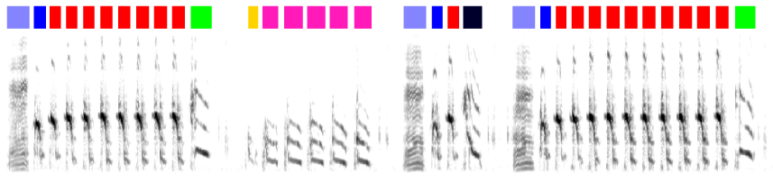

================
``vak`` वाच् *vāc*
================

a neural network toolbox for animal vocalizations and bioacoustics
==================================================================

``vak`` is a library that makes it easier
for researchers studying animal
vocalizations---such as birdsong, bat calls,
and even human speech---to work with
neural network algorithms.

Currently the main use is automated **annotation** of animal vocalizations.
By **annotation**, we mean something like this example of annotated birdsong:

.. image:: images/annotation_example_for_tutorial.png

Please see links below for information on how to get started and how to use ``vak`` to
apply neural network models to your data.

:ref:`get_started`
---------------------------------
If you are new to working with ``vak``,
and you're looking for installation instructions and a tutorial,
:ref:`start here <get_started>`.

:ref:`howto`
-------------
If there is something specific you're trying to do,
like use your own spectrogram files or annotation formats with ``vak``,
please check in the :ref:`howto`.

:ref:`reference`
----------------
If you need to look up information about the command-line interface, configuration files, etc.,
please consult the :ref:`reference`.

:ref:`about`
------------
For more about the goals of ``vak`` and its development, please see :ref:`about`.

:ref:`poems`
------------
Not enough open-source research software libraries have :ref:`poems`.

.. toctree::
   :hidden:

   get_started/get_started
   howto/howto
   reference/reference
   reference/about
